## Banking System

The Banking System, developed using Java and SQL, serves as a comprehensive ATM Simulator that replicates the core functionalities of a traditional ATM. It allows users to open banking accounts, perform deposits and withdrawals, view mini statements, and change their PINs, providing a user-friendly interface for seamless banking operations. The system leverages Java for robust backend logic and SQL for efficient data management, ensuring secure and reliable transactions. Key Java packages used in this application include:

1.java.awt: Used for building the graphical user interface (GUI), allowing for the creation of windows, buttons, and other UI components.

2.java.awt.event: Provides classes for handling events such as button clicks and user interactions.

3.javax.swing: Enhances the GUI capabilities with more sophisticated components like panels, dialogs, and customized controls.

4.java.sql: Facilitates database connectivity and management, enabling secure interactions with the banking database.

This simulation not only enhances understanding of banking processes but also offers a practical application of programming concepts in real-world scenarios. Overall, it stands as a valuable tool for learning and demonstrating key banking operations.

I have attached the output screenshots below:

## Screenshots

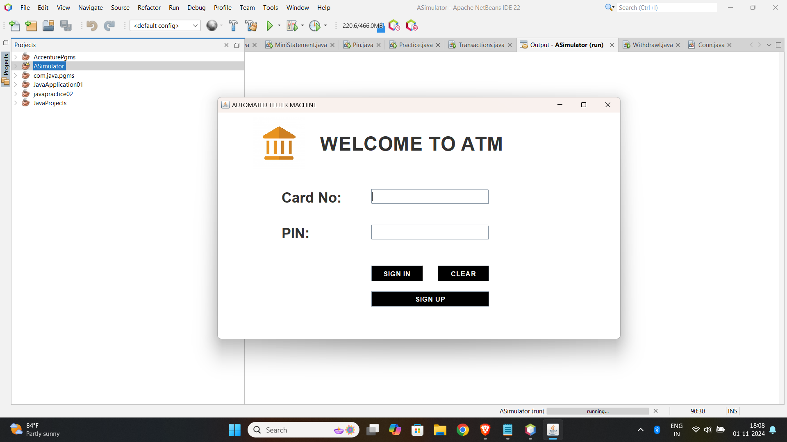
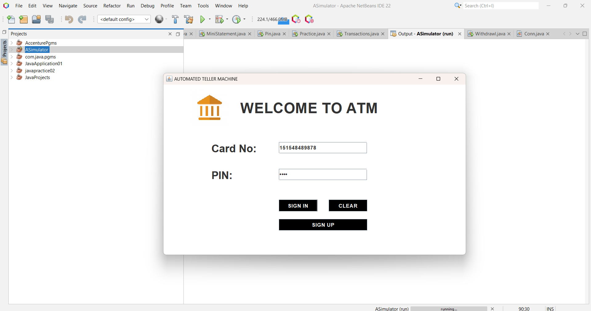
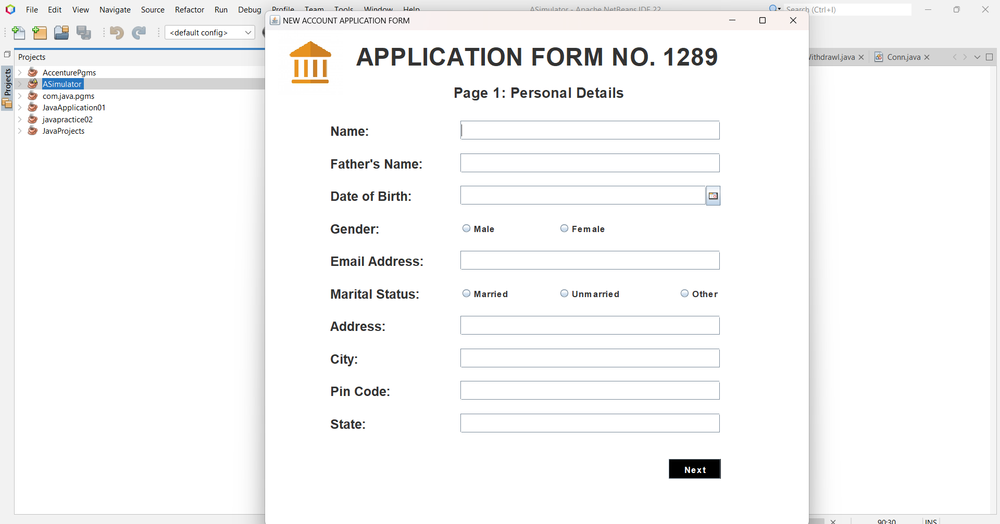
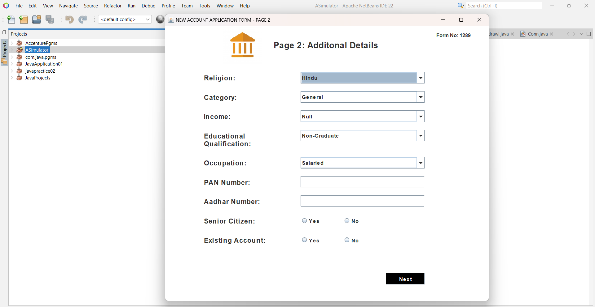
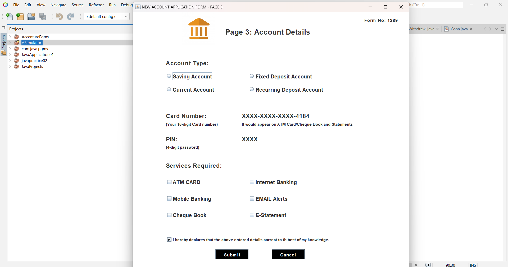
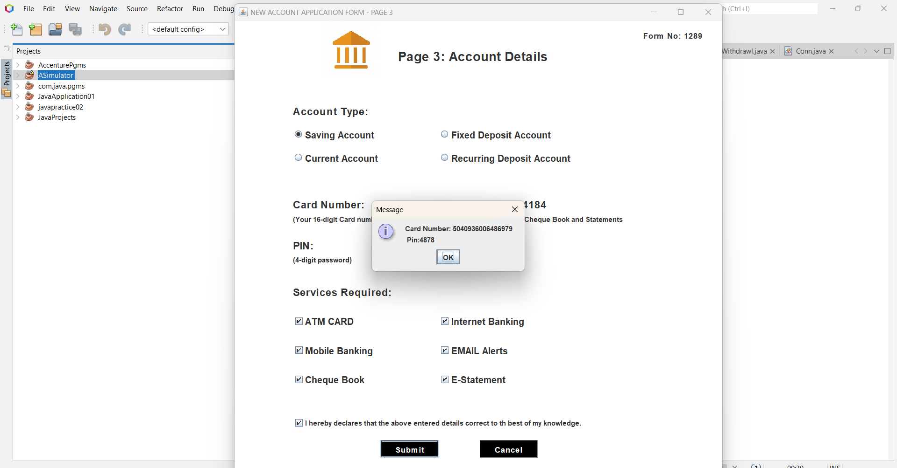
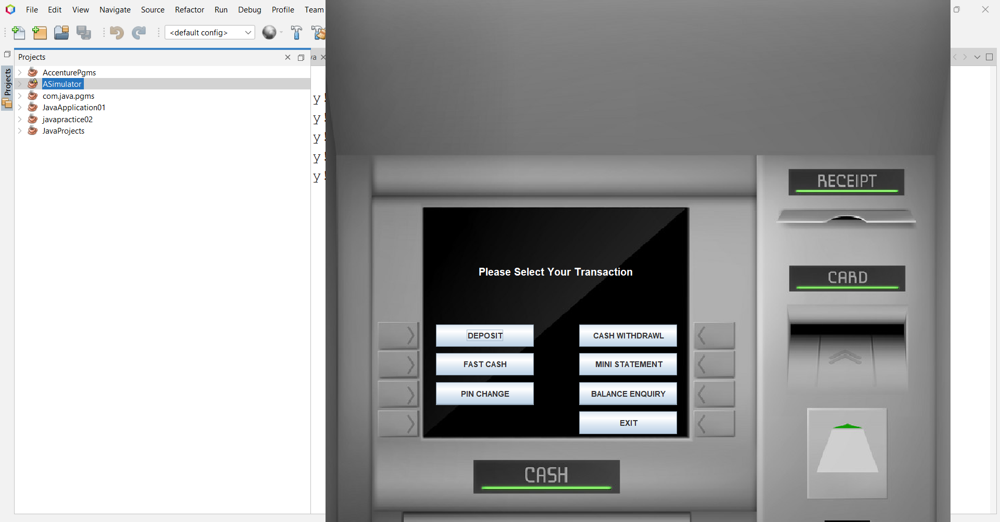

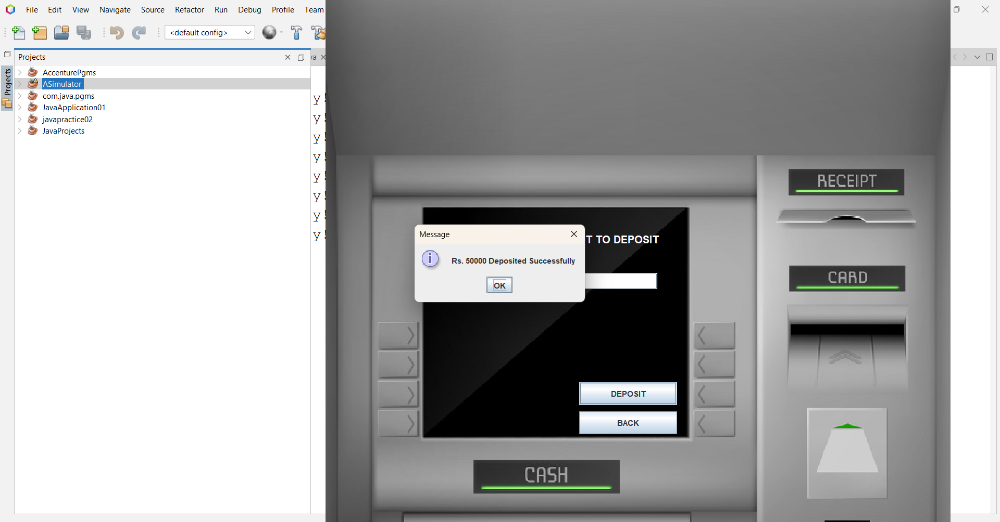
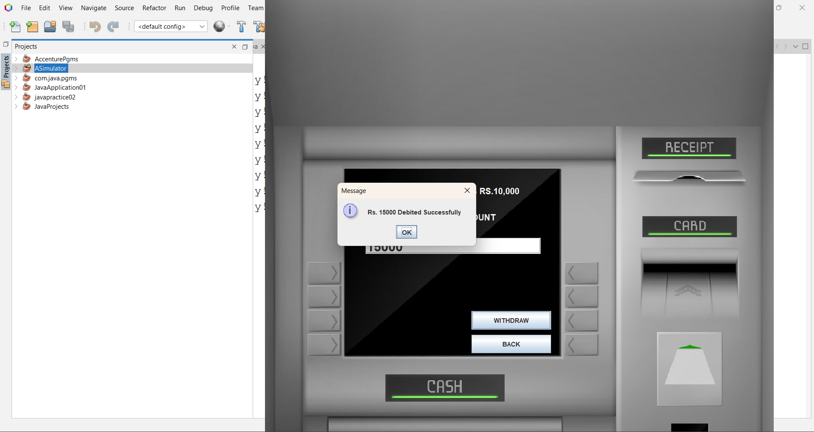
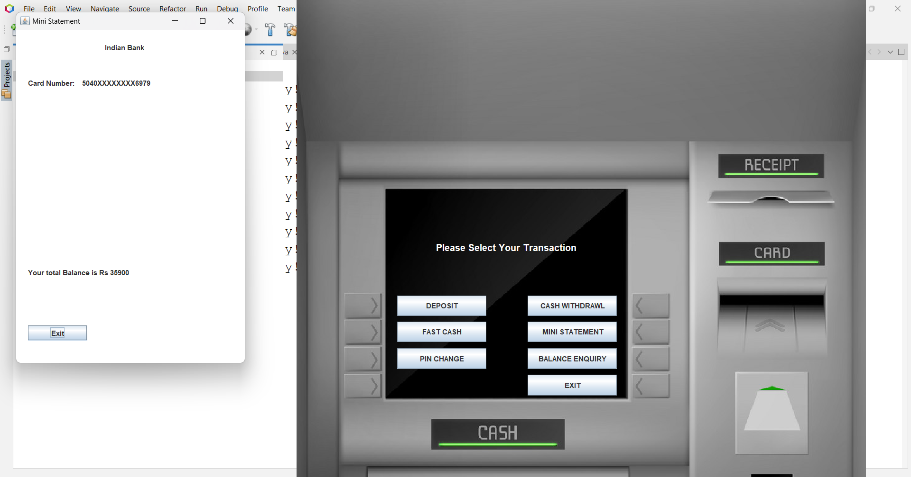
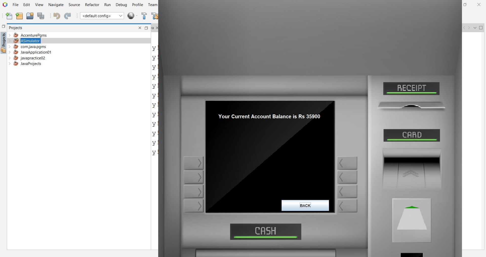
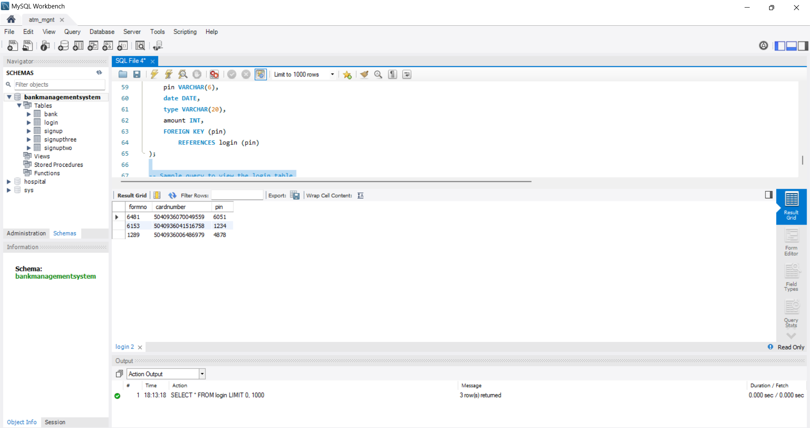
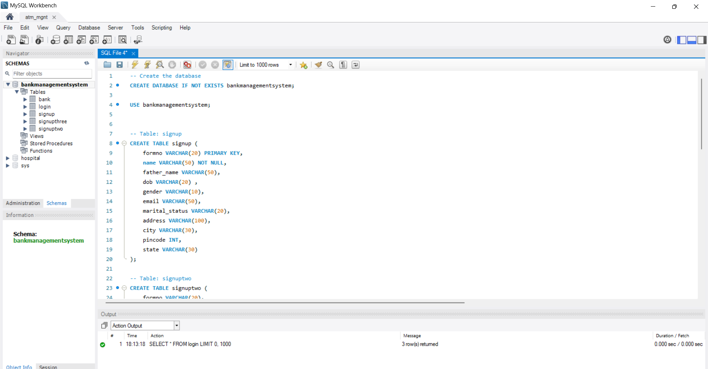