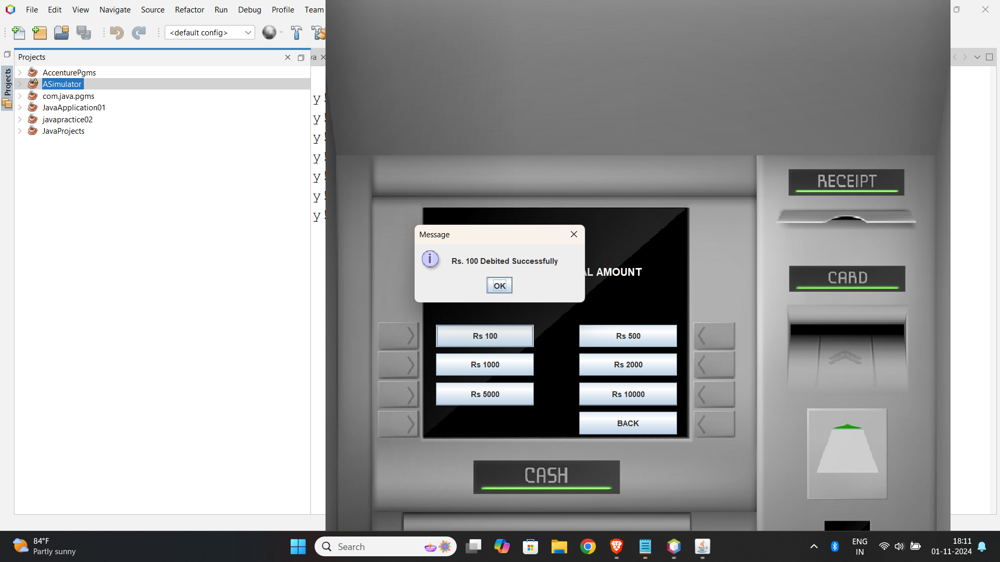

# Banking System

**Comprehensive ATM Simulator Application**

[](LICENSE)
[](VERSION)
[](https://www.java.com)
[](https://www.mysql.com)

A sophisticated ATM Simulator that replicates the core functionalities of traditional banking systems. Built with Java and SQL, this application provides a comprehensive banking experience with secure account management, transaction processing, and user-friendly GUI operations.

---

## 🎯 Key Highlights

- **🏦 Complete ATM Simulation** - Full-featured banking operations and account management
- **💳 Secure Transactions** - Safe deposit, withdrawal, and balance inquiry operations
- **🖥️ Professional GUI** - Intuitive Swing-based user interface design
- **🔒 PIN Security** - Secure authentication and PIN change functionality
- **📊 Transaction History** - Mini statement generation and account tracking
- **🗄️ Database Integration** - Robust SQL database for data persistence and security

---

## 📋 Table of Contents

- [Features](#-features)
- [System Architecture](#-system-architecture)
- [Usage Guide](#-usage-guide)
- [Technical Implementation](#-technical-implementation)
- [Database Design](#-database-design)
- [Screenshots](#-screenshots)
- [License](#-license)

---

## ✨ Features

### Core Banking Operations
- **Account Management** - Create and manage banking accounts with unique identifiers
- **Secure Authentication** - PIN-based login system with validation
- **Money Deposits** - Add funds to accounts with real-time balance updates
- **Cash Withdrawals** - Secure fund withdrawal with sufficient balance verification
- **Balance Inquiry** - Instant account balance checking and display
- **Mini Statements** - Transaction history and account activity reports

### Security Features
- **PIN Protection** - Secure 4-digit PIN authentication system
- **PIN Change Functionality** - Users can update their PINs for enhanced security
- **Transaction Validation** - Input validation and error handling for all operations
- **Secure Database Storage** - Encrypted data storage and retrieval
- **Session Management** - Proper user session handling and timeout

### User Experience
- **Intuitive GUI** - Professional Swing-based graphical interface
- **Error Handling** - Comprehensive error messages and user guidance
- **Real-time Updates** - Instant balance and transaction status updates
- **User-Friendly Navigation** - Clear menu options and easy operation flow
- **Responsive Design** - Consistent interface across different screen sizes

---

## 🏗 System Architecture

The Banking System employs a robust architecture combining Java application logic with SQL database management:

### 1. ☕ Java Application Layer

**Purpose**: Handles business logic, user interface, and application flow control

**Key Components**:
- **GUI Framework (java.awt & javax.swing)**
  - Professional window-based interface design
  - Interactive buttons, panels, and dialog boxes
  - Custom components for banking operations
  - Event handling for user interactions

- **Event Management (java.awt.event)**
  - Button click handlers for ATM operations
  - Form submission and validation events
  - User input processing and feedback
  - Navigation between different banking screens

- **Business Logic Layer**
  - Account creation and management algorithms
  - Transaction processing and validation logic
  - Balance calculation and update mechanisms
  - Security protocols for PIN management

### 2. 🗄️ Database Layer (java.sql)

**Purpose**: Manages data persistence, security, and transaction integrity

**Key Components**:
- **Database Connectivity**
  - JDBC connection management for secure database access
  - Connection pooling for optimal performance
  - Transaction management with commit/rollback functionality
  - Error handling for database operations

- **Data Management**
  - Account information storage and retrieval
  - Transaction history tracking and logging
  - Secure PIN storage with encryption
  - Balance management and audit trails

- **Query Optimization**
  - Efficient SQL queries for fast data retrieval
  - Indexed database design for quick searches
  - Prepared statements for security and performance
  - Database normalization for data integrity

### 3. 🔒 Security Architecture

**Purpose**: Ensures secure banking operations and data protection

**Key Features**:
- **Authentication System**
  - Multi-layer security with PIN verification
  - Session-based authentication management
  - Failed attempt tracking and account lockout
  - Secure logout and session termination

- **Data Encryption**
  - PIN encryption for secure storage
  - Transaction data protection mechanisms
  - Secure communication between application and database
  - Data validation and sanitization

### 4. 🖥️ User Interface Design

**Purpose**: Provides intuitive and professional banking interface

**Implementation**:
- **Swing Components**
  - Professional layouts with consistent styling
  - Custom button designs for banking operations
  - Informative dialog boxes and confirmation screens
  - Responsive panels for different ATM functions

- **User Experience Flow**
  - Logical navigation between banking operations
  - Clear visual feedback for successful transactions
  - Error messaging and user guidance systems
  - Intuitive menu structures and operation flows

---

## 📱 Usage Guide

### Getting Started

#### 1. **System Setup**
   - Ensure Java Runtime Environment (JRE) is installed
   - Set up SQL database with required banking tables
   - Configure database connection parameters
   - Launch the ATM Simulator application

#### 2. **Account Creation**
   - Navigate to the account registration screen
   - Enter personal information and initial deposit
   - Set up a secure 4-digit PIN
   - Receive account number for future transactions

### Banking Operations

#### Account Login
1. **Enter Credentials**: Input your account number and PIN
2. **Authentication**: System verifies credentials against database
3. **Access Granted**: Successful login provides access to ATM menu
4. **Session Start**: Begin banking operations with full account access

#### Core ATM Functions

##### Cash Deposit
1. Select "Deposit" from the main ATM menu
2. Enter the amount to be deposited
3. Confirm the transaction details
4. View updated account balance immediately

##### Cash Withdrawal
1. Choose "Withdrawal" from the available options
2. Enter the desired withdrawal amount
3. System checks for sufficient account balance
4. Complete transaction and receive updated balance

##### Balance Inquiry
1. Select "Balance Inquiry" from the menu
2. View current account balance instantly
3. See last transaction date and details
4. Return to main menu for additional operations

##### Mini Statement
1. Choose "Mini Statement" option
2. View recent transaction history
3. See transaction types, amounts, and dates
4. Print or save statement for records

##### PIN Change
1. Select "Change PIN" from security options
2. Enter current PIN for verification
3. Input new 4-digit PIN twice for confirmation
4. Receive confirmation of successful PIN update

### Security Best Practices

#### PIN Management
- **Choose Unique PINs**: Avoid common combinations like 1234 or birthdates
- **Regular Updates**: Change PIN periodically for enhanced security
- **Secure Storage**: Never share or write down your PIN
- **Failed Attempts**: Account locks after multiple failed login attempts

#### Transaction Safety
- **Verify Amounts**: Double-check all transaction amounts before confirmation
- **Monitor Balance**: Regularly check account balance for unauthorized transactions
- **Keep Records**: Maintain transaction receipts and mini statements
- **Logout Properly**: Always complete proper logout to secure your session

---

## 🔧 Technical Implementation

### Development Environment
- **Java SE Development Kit (JDK)**: Core development platform
- **Integrated Development Environment (IDE)**: IntelliJ IDEA or Eclipse
- **Database Management System**: MySQL or PostgreSQL
- **JDBC Driver**: Database connectivity and SQL operations

### Key Java Packages Utilized

#### GUI Development
```java
import java.awt.*;          // Core GUI components and layouts
import java.awt.event.*;    // Event handling for user interactions
import javax.swing.*;       // Advanced Swing components and dialogs
```

#### Database Operations
```java
import java.sql.*;          // Database connectivity and SQL operations
import java.sql.Connection; // Database connection management
import java.sql.PreparedStatement; // Secure SQL query execution
```

### Architecture Highlights
- **Object-Oriented Design**: Modular class structure for maintainable code
- **MVC Pattern**: Separation of Model, View, and Controller components
- **Exception Handling**: Comprehensive error management and user feedback
- **Database Abstraction**: Generic database operations for different SQL systems

### Performance Features
- **Connection Pooling**: Efficient database connection management
- **Prepared Statements**: Optimized SQL execution and security
- **Memory Management**: Proper resource cleanup and garbage collection
- **Threading**: Responsive GUI with background database operations

### Security Implementation
- **Input Validation**: Comprehensive data sanitization and validation
- **SQL Injection Prevention**: Parameterized queries and prepared statements
- **PIN Encryption**: Secure storage of sensitive authentication data
- **Session Security**: Proper session management and timeout handling

---

## 🗄️ Database Design

### Core Tables Structure

#### Accounts Table
```sql
CREATE TABLE accounts (
    account_id VARCHAR(20) PRIMARY KEY,
    account_holder_name VARCHAR(100) NOT NULL,
    pin VARCHAR(10) NOT NULL,
    balance DECIMAL(15,2) DEFAULT 0.00,
    account_type VARCHAR(20) DEFAULT 'SAVINGS',
    created_date TIMESTAMP DEFAULT CURRENT_TIMESTAMP,
    last_transaction_date TIMESTAMP
);
```

#### Transactions Table
```sql
CREATE TABLE transactions (
    transaction_id INT AUTO_INCREMENT PRIMARY KEY,
    account_id VARCHAR(20),
    transaction_type VARCHAR(20) NOT NULL,
    amount DECIMAL(15,2) NOT NULL,
    balance_after DECIMAL(15,2) NOT NULL,
    transaction_date TIMESTAMP DEFAULT CURRENT_TIMESTAMP,
    FOREIGN KEY (account_id) REFERENCES accounts(account_id)
);
```

### Database Features
- **Referential Integrity**: Foreign key constraints ensure data consistency
- **Transaction Logging**: Complete audit trail for all banking operations
- **Data Types**: Appropriate data types for financial calculations
- **Indexing**: Optimized queries with proper database indexing

---

## 📸 Screenshots

### Account Registration Process

*Initial login interface for accessing the ATM system*


*Comprehensive personal information registration form*

### Account Setup and Configuration

*Personal details form with required customer information*


*Additional details form for complete account setup*

### Account Information Management

*Complete account details display and management*


*Account configuration and setup interface*

### ATM Operations Interface

*Main ATM menu with all available banking operations*


*Cash withdrawal interface with amount input*

### Transaction Processing

*Debit transaction processing and confirmation*


*Transaction completion with balance update*

### Account Information and History

*Mini statement showing recent transaction history*


*Current account balance display with transaction details*

### Database Implementation

*Database schema and table structure for the banking system*


*SQL implementation showing database connectivity and operations*

---

## 📄 License

This project is licensed under the MIT License - see the [LICENSE](LICENSE) file for details.